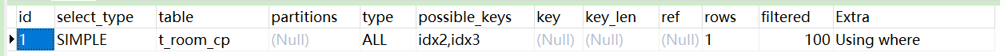
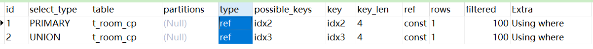

精彩好文   值得仔细阅读

https://www.cnblogs.com/arthinking/p/13205303.html


---


## UNION ALL与UNION 关键字的使用

优化前-全表扫描type=ALL

```
SELECT * from t_room_cp WHERE (man_uuid = 120034 OR woman_uuid = 120034 )and id_delete = 1
```



优化后 type = ref

```
SELECT man_uuid from t_room_cp WHERE man_uuid = 120034  and id_delete = 0
UNION ALL
SELECT woman_uuid from t_room_cp WHERE  woman_uuid = 120034 and id_delete = 0
```



