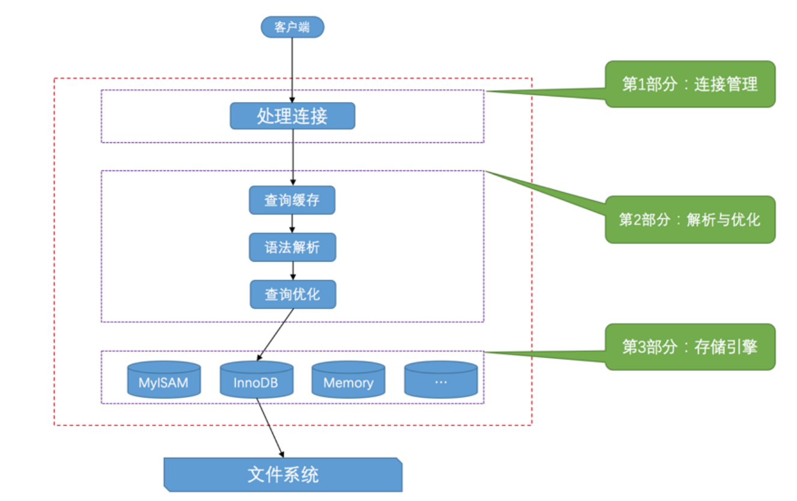

Mysql客户端进程 向 服Mysql务端进程 发送请求并得到返回数据的过程  **本质上是一个进程间的通信过程.**

## 客户端进程和服务器进程的通信方式

### 1.TCP/IP 

> IP地址 + 端口号  mysql服务器默认监听3306   也可以自定义为3307    命令mysqld -P3307 

### 2.Unix域 套接字文件

> MySQL服务器程序默认监听的Unix域套接字文件路径为/tmp/mysql.sock

举一反三

想一想 Nginx与PHP-FPM的通讯方式  127.0.0.0:9000   和fastcgi_pass unix:/dev/shm/php-cgi.sock;

是不是和这里的很相似呢?


## SQL语句的执行流程



### 连接管理

> 1.连接池,减少频繁创建/销毁线程的次数
>
> 2.合理的控制最大连接数

### 解析与优化

#### 查询缓存

> 1.两次一模一样的SQL  第二次的结果直接从缓存里获取  但是必须完全一模一样,且SQL中不能有计算函数
>
> 2.该表的结构或者数据被修改时,查询缓存失效
>
> ​		如对该表使用了INSERT、 UPDATE、DELETE、ALTER TABLE、DROP TABLE语句，那使用该表的所有的查询缓存都被删除！
>
> 3.从MySQL 5.7.20开始，不推荐使用查询缓存，并在MySQL 8.0中删除

#### 语法解析

#### 查询优化

>1.调整where关键字后面的条件顺序
>
>

### 存储引擎

查看当前服务器程序支持的存储引擎

```
mysql> SHOW ENGINES;
其中
Transactions列代表该存储引擎是否支持事务处理。
XA列代表着该存储引擎是否支持分布式事务。
Savepoints代表着该存储引擎是否支持部分 事务回滚。

Support列表示该存储引擎是否可用，
DEFAULT值代表是当前服务器程序的默认存储引擎。
Comment列是对存储引擎的一个描述，英文的，将就着 看吧。

```

##  MySQL中的utf8和utf8mb4

utf8最多占用3个字节

utf8mb4最多占用4个字节

在MySQL中提到utf8就意味着使用1~3个字节来表示一个字符，如果大家有使用4字节编码一个字符的情况，比如存储一些emoji表情啥的，那请使用utf8mb4

比如utf8_general_ci这个比较规则是以ci结尾的，说明不区分大小写。


##  InnoDB记录 存储结构

> InnoDB采取的方式是：将数据划分为若干个页，以页作为磁盘和内存之间交互的基本单位，InnoDB中页的大小一般为 **16** KB。
>
> 也就是在一般情况下，一次最少从磁盘中读取16KB的内容到内存中，一次最少把内存中的16KB内容刷新到磁盘中。

各个数据页可以组成一个双向链表，而每个数据页中的多条记录(单个数据页16kb,肯定不止存储一条数据.)

会按照主键值从小到大的顺序组成一个单向链表，


不论我们怎么对页中的记录做增删改操作，InnoDB始终会维护一条记录的单链表，链表中的各个节点是按照主键值由小到大的顺序连接起来的