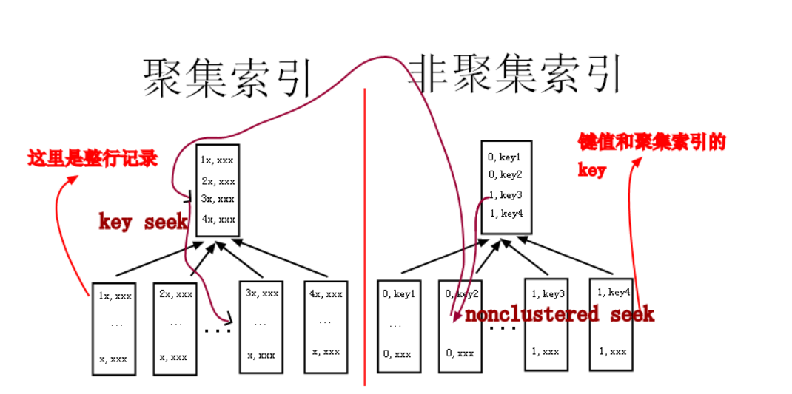

Mysql客户端进程 向 服Mysql务端进程 发送请求并得到返回数据的过程  **本质上是一个进程间的通信过程.**

## 客户端进程和服务器进程的通信方式

### 1.TCP/IP 

> IP地址 + 端口号  mysql服务器默认监听3306   也可以自定义为3307    命令mysqld -P3307 

### 2.Unix域 套接字文件

> MySQL服务器程序默认监听的Unix域套接字文件路径为/tmp/mysql.sock

举一反三

想一想 Nginx与PHP-FPM的通讯方式  127.0.0.0:9000   和fastcgi_pass unix:/dev/shm/php-cgi.sock;

是不是和这里的很相似呢?


## SQL语句的执行流程


### 连接管理

> 1.连接池,减少频繁创建/销毁线程的次数
>
> 2.合理的控制最大连接数

### 解析与优化

#### 查询缓存

> 1.两次一模一样的SQL  第二次的结果直接从缓存里获取  但是必须完全一模一样,且SQL中不能有计算函数
>
> 2.该表的结构或者数据被修改时,查询缓存失效
>
> ​		如对该表使用了INSERT、 UPDATE、DELETE、ALTER TABLE、DROP TABLE语句，那使用该表的所有的查询缓存都被删除！
>
> 3.从MySQL 5.7.20开始，不推荐使用查询缓存，并在MySQL 8.0中删除

#### 语法解析

#### 查询优化

>1.调整where关键字后面的条件顺序
>
>

### 存储引擎

查看当前服务器程序支持的存储引擎

```
mysql> SHOW ENGINES;
其中
Transactions列代表该存储引擎是否支持事务处理。
XA列代表着该存储引擎是否支持分布式事务。
Savepoints代表着该存储引擎是否支持部分 事务回滚。

Support列表示该存储引擎是否可用，
DEFAULT值代表是当前服务器程序的默认存储引擎。
Comment列是对存储引擎的一个描述，英文的，将就着 看吧。

```

##  MySQL中的utf8和utf8mb4

utf8最多占用3个字节

utf8mb4最多占用4个字节

在MySQL中提到utf8就意味着使用1~3个字节来表示一个字符，如果大家有使用4字节编码一个字符的情况，比如存储一些emoji表情啥的，那请使用utf8mb4

比如utf8_general_ci这个比较规则是以ci结尾的，说明不区分大小写。


##  InnoDB记录 存储结构

> InnoDB采取的方式是：将数据划分为若干个页，以页作为磁盘和内存之间交互的基本单位，InnoDB中页的大小一般为 **16** KB。
>
> 也就是在一般情况下，一次最少从磁盘中读取16KB的内容到内存中，一次最少把内存中的16KB内容刷新到磁盘中。

各个数据页可以组成一个双向链表，而每个数据页中的多条记录(单个数据页16kb,肯定不止存储一条数据.)

会按照主键值从小到大的顺序组成一个单向链表，


不论我们怎么对页中的记录做增删改操作，InnoDB始终会维护一条记录的单链表，链表中的各个节点是按照主键值由小到大的顺序连接起来的


## 聚簇索引

### 特点1. 使用记录主键值的大小进行记录和页的排序

这包括三个方面的含义： 

页内的记录是按照主键的大小顺序排成一个单向链表。 

各个存放用户记录的页也是根据页中用户记录的主键大小顺序排成一个双向链表。 

存放目录项记录的页分为不同的层次，在同一层次中的页也是根据页中目录项记录的主键大小顺序排成一个双向链表。 

### 特点2:B+树的叶子节点存储的是完整的用户记录。 

所谓完整的用户记录，就是指这个记录中存储了所有列的值（包括隐藏列）。也就是所谓的索引即数据，数据即索引


## 二级索引[辅助索引]

二级索引的最后,存储的是主键id

<font color=red>必须再根据主键值去聚簇索引中再查找一遍完整的用户记录</font>



### 叶子节点 与中间节点的区别

|              | 主键索引(聚集索引)               | 辅助索引(非聚集索引)                                     |
| ------------ | -------------------------------- | -------------------------------------------------------- |
| **中间节点** | 保存主键和指针                   | 保存非主键键值，以及指针                                 |
| **叶子节点** | 保存主键，并且保存主键对应的数据 | 保存非主键键值，以及主键（还需要再通过主键查询获取数据） |
|              |                                  |                                                          |

## 联合索引

> 联合索引本质还是一个二级索引   
>
> 比如为A B字段建立一个索引,会创建一个B+树
>
> 如果为A B字段分别建立索引,会创建2个B+树

### 联合索引(A,B,C)

```
以下 可以使用到索引

a,b,c  全值匹配  bac 查询优化器会自动颠倒顺序  
a      ab      ac

以下无法使用到索引
b   c    ac    bc   
```


<font color=red>有多少个索引 就会有多少个B+Tree树</font>

## Myisam引擎的索引结构

> MyISAM中索引是索引、数据是数据  是分开的
>
> 最后一级的叶子节点存储的是 数据的物理内存地址.

## 覆盖索引

查询列表里只包含索引列  只需要用到索引的查询方式称为索引覆盖  避免回表查询.


## 索引总结

\1. B+树索引在空间和时间上都有代价，所以没事儿别瞎建索引。 

\2. B+树索引适用于下边这些情况： 

全值匹配 

匹配左边的列 

匹配范围值 

精确匹配某一列并范围匹配另外一列 

用于排序 

用于分组 

\3. 在使用索引时需要注意下边这些事项： 

只为用于搜索、排序或分组的列创建索引 

为列的基数大的列创建索引 

索引列的类型尽量小 

可以只对字符串值的前缀建立索引 

只有索引列在比较表达式中单独出现才可以适用索引 

为了尽可能少的让聚簇索引发生页面分裂和记录移位的情况，建议让主键拥有AUTO_INCREMENT属性。 

定位并删除表中的重复和冗余索引 

尽量使用覆盖索引进行查询，避免回表带来的性能损耗