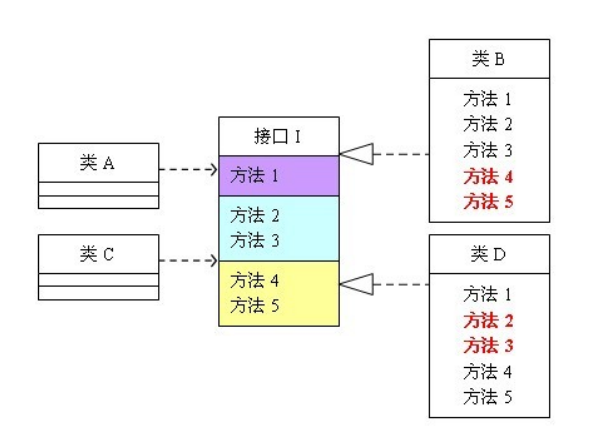
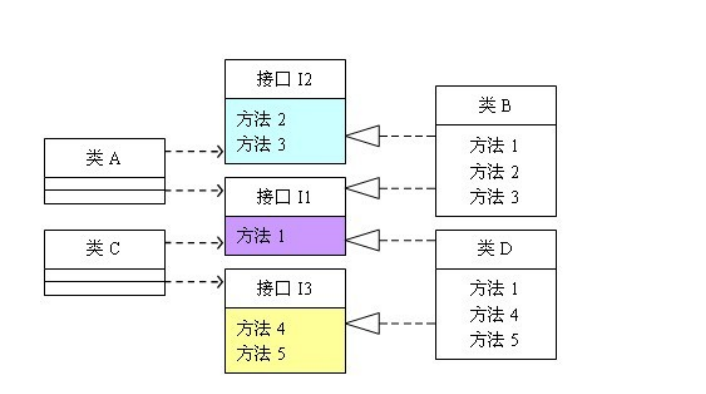

## 单一职责原则

> 又称功能单一原则
>
> 一个类只负责一个功能   一个函数只负责一个功能

### 优点

可以降低类的复杂度，一个类只负责一项职责，其逻辑肯定要比负责多项职责简单的多；

提高类的可读性,提高代码的可维护性

降低需求变更时代码变更,引起的风险

### 补充

不只是面向对象编程思想所特有的，只要是模块化的程序设计，都适用单一职责原则

## 里氏替换原则 

### 名称由来

> 1988年 由麻省理工学院的一位姓里的女士（Barbara Liskov）提出来的
>
> 所以 可简称为 替换原则

### 定义

所有使用父类的地方都能透明地使用其子类的对象。

**一个程序中如果使用的是一个父类，那么该程序一定适用于其子类，而且程序察觉不出父类和子类对象的区别。也就是说在程序中，把父类都替换成它的子类，程序的行为没有任何变化。**

### 重点思想

子类继承父类以后,可以扩展父类的功能,但是不能修改父类的功能.

细节

>子类可以实现父类的抽象方法，但不能覆盖父类的非抽象方法。
>
>• 子类中可以增加自己特有的方法。
>
>• 当子类的方法重载父类的方法时，方法的前置条件（即方法的形参）要比父类方法的输入参数更宽松。
>
>• 当子类的方法实现父类的抽象方法时，方法的后置条件（即方法的返回值）要比父类更严格。

## 依赖倒置原则=>面向抽象编程

### 定义

> 依赖抽象接口,不依赖具体实现.      模块之间依赖抽象

TDD开发模式就是依赖倒置原则最成功的应用

PHP的MVC框架中,日常开发中,对接口的使用比较少,

Java开发,使用接口比较多.

### 传递依赖关系的3种方式

1.接口传递

2.构造方法

3.setter方法

### 重点注意

1.低层模块尽量都要有抽象类或接口，或者两者都有。

2.变量的声明类型尽量是抽象类或接口。

3.使用继承时遵循里氏替换原则。

### 依赖倒置原则的最佳实践

**控制反转（IoC）就是遵循了依赖倒置原则的一个思想。**

## 接口隔离原则

### 定义

当前类不应该依赖它不需要的接口

一个类对另外一个类的依赖  应该建立在最小的接口上

### 有问题的依赖

> 类A需要方法1,2,3 , 不需要4,5       类B需要方法1,4,5,不需要23
>
> 但是接口I 包含了功能1,2,3,4,5
>
> 那么类A和类B中都存在自己不需要的方法,但又不得不实现.

### 合理的依赖

> 把接口I拆分成接口3个接口   类A和类B都需要的,为一个接口  独立需要的各位一个接口.

### 重点

> 接口粒度要合理  单个接口包含的方法不能太多     也不能太少

### 与单一只能原则的区别

单一职责原则原注重的是职责；而接口隔离原则注重对接口依赖的隔离。

其二，单一职责原则主要是约束类，其次才是接口和方法，它针对的是程序中的实现和细节；

而接口隔离原则主要约束接口接口，主要针对抽象，针对程序整体框架的构建

## 迪米特法则=>最少知道原则

### 定义

一个类对其他类应该保持最少的了解

### 问题由来

类与类之间的依赖关系越大,当一个类发生改变时,对其他类的影响就越大

## 开闭原则

### 定义

#### 鼓励扩展,关闭修改.

当需求变更时,减少对现有代码的修改,通过新增方法的方式来满足新需求, 典型的例子就是接口地址的版本控制.

#### 用抽象构建框架，用实现扩展细节

## 总结

单一职责原则告诉我们实现类要职责单一；

里氏替换原则告诉我们不要破坏继承体系；

依赖倒置原则告诉我们要面向接口编程；

接口隔离原则告诉我们在设计接口的时候要精简单一；

迪米特法则告诉我们要降低耦合。

而开闭原则是总纲，他告诉我们要对扩展开放，对修改关闭。

